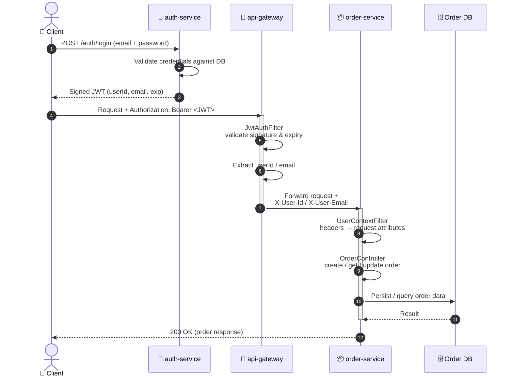
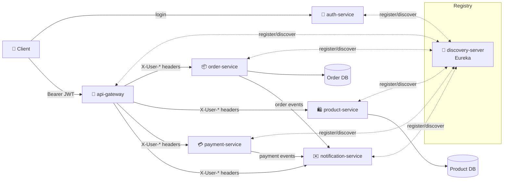

# 🔐 JWT Authentication & Request Flow — spring-cloud-ecommerce

> How a request travels from **login** through **`auth-service`** → **`api-gateway`** → the downstream microservices in [`biruksolomon/spring-cloud-ecommerce`](https://github.com/biruksolomon/spring-cloud-ecommerce).


---

## 📑 Table of Contents

- [Overview](#-overview)
- [Sequence Diagram](#-sequence-diagram)
- [Step-by-Step Breakdown](#-step-by-step-breakdown)
- [JWT Payload Reference](#-jwt-payload-reference)
- [Internal Headers Contract](#-internal-headers-contract)
- [Service Map](#-service-map)

---

## 🧭 Overview

`auth-service` owns identity: it validates credentials and mints a signed **JWT**. Every other call to the platform passes through `api-gateway`, which validates the token **once** via `JwtAuthFilter` and forwards lightweight, trusted `X-User-*` headers to whichever service — `product-service`, `order-service`, `payment-service`, or `notification-service` — actually needs to know who's calling. Those services stay JWT-agnostic; they only ever read request attributes populated from headers, resolved through `discovery-server` (Eureka) for service-to-service routing.

```
👤 Client  →  🔐 auth-service  →  🚪 api-gateway  →  📦 order-service  →  🗄️ Order DB
                                        │
                                        ├──▶ 🛍️ product-service
                                        ├──▶ 💳 payment-service
                                        └──▶ ✉️ notification-service
```

---

## 🔄 Sequence Diagram

> Renders natively on GitHub — paste straight into `docs`.



---

## 🪜 Step-by-Step Breakdown

| # | Stage | Component | What Happens |
|---|-------|-----------|---------------|
| 1 | **Login** | Client → `auth-service` | `POST /auth/login` with email + password |
| 2 | **Token issuance** | `auth-service` | Verifies credentials against its user store, signs a JWT with the shared secret/key |
| 3 | **Authenticated call** | Client → `api-gateway` | Every request carries `Authorization: Bearer <JWT>` |
| 4 | **Validation** | `JwtAuthFilter` (gateway) | Verifies signature, checks expiry, rejects invalid/expired tokens with `401` |
| 5 | **Header propagation** | `api-gateway` → service | Gateway strips the raw JWT and injects `X-User-Id` / `X-User-Email` |
| 6 | **Service discovery** | `api-gateway` ↔ `discovery-server` | Gateway resolves the target service instance via Eureka before routing |
| 7 | **Context binding** | `UserContextFilter` (service) | Converts headers into request attributes for controllers |
| 8 | **Business logic** | e.g. `OrderController` | Reads `request.getAttribute("userId")`, executes the use case |
| 9 | **Persistence / side effects** | Service DB / events | Order is stored; `notification-service` reacts to order/payment events |

---

## 🎫 JWT Payload Reference

```json
{
  "sub": "123",
  "email": "user@test.com",
  "iat": 1753776000,
  "exp": 1753779600
}
```

| Claim | Purpose |
|---|---|
| `sub` | Unique user ID (`userId`) |
| `email` | User's email address |
| `iat` / `exp` | Issued-at / expiration — the gateway rejects the request once `exp` passes |

> 🔒 Signed by `auth-service` with a shared secret (HMAC) or key pair; `api-gateway` verifies every incoming token before it reaches any downstream service.

---

## 📬 Internal Headers Contract

`api-gateway` never forwards the raw JWT past itself — internal services trust a minimal identity contract instead:

| Header | Example | Consumed By |
|---|---|---|
| `X-User-Id` | `123` | `UserContextFilter` in `order-service`, `payment-service` |
| `X-User-Email` | `user@test.com` | `notification-service` (order/payment confirmations) |

This keeps `product-service`, `order-service`, `payment-service`, and `notification-service` **stateless and auth-agnostic** — `api-gateway` is their sole trust boundary.

---

## 🧩 Service Map



| Service | Responsibility |
|---|---|
| 🔐 **auth-service** | Owns credentials, issues & signs JWTs |
| 🧭 **discovery-server** | Eureka registry — service discovery for every node below |
| ⚙️ **config-server** | Serves centralized config to every service below from the separate `config-repo` git repo (see [`config-repo/README.md`](../config-repo/README.md)) |
| 🚪 **api-gateway** | Single entry point; validates JWTs once, routes via Eureka, injects identity headers |
| 🛍️ **product-service** | Catalog, pricing, product metadata |
| 📦 **order-service** | Order lifecycle — create, fetch, update |
| 💳 **payment-service** | Payment processing tied to orders |
| ✉️ **notification-service** | Reacts to order/payment events, sends confirmations |
| 🚚 **delivery-service** | Shipment tracking; consumes order events, publishes delivery status back to order-service |

> `discovery-server` and `config-server` are the two infra services everything else depends on, so — to avoid a circular bootstrap — neither one is itself a config-server client; their config stays local to their own module.

---

<sub>📁 Part of <a href="https://github.com/biruksolomon/spring-cloud-ecommerce">biruksolomon/spring-cloud-ecommerce</a> — Spring Boot · Spring Cloud Gateway · Eureka · Spring Cloud Config · JWT</sub>